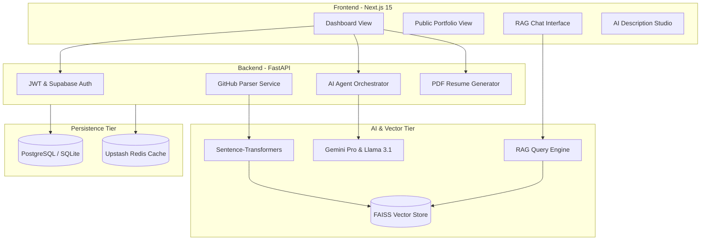

# 🚀 ZENVYRA

[](https://nextjs.org/)
[](https://fastapi.tiangolo.com/)
[](https://tailwindcss.com/)
[](https://deepmind.google/technologies/gemini/)

> **The ultimate engineering showcase: Automating the bridge between code and recruitment with Agentic AI.**

The **ZENVYRA** is a sophisticated full-stack application that transforms raw developer data into a recruiter-ready experience. By combining **GitHub Intelligence**, **LLM-driven text refinement**, and **Retrieval Augmented Generation (RAG)**, it enables developers to showcase their True Technical Value™ without the manual overhead of traditional portfolio builders.

---

## 🏗️ High-Level Architecture

The system is built on a **Modular Micro-Service Architecture** to ensure clean separation of concerns and high scalability.



---

## 💎 Key Features

### 🧠 **RAG-Powered Professional Chatbot**
- **Semantic Retrieval**: Uses **Sentence-Transformers** to vectorize your project READMEs and descriptions.
- **Context-Aware Inference**: Queries a **FAISS** vector store to feed real project context into **Llama 3.1 (via Groq)**, allowing recruiters to ask specific questions like *"What was Ishan's role in the ChemViz project?"*
- **Real-Time Streaming**: Delivers AI responses with ultra-low latency.

### 🪄 **Agentic "Impact" Enhancer**
- **ATS Optimization**: Leverages **Google Gemini Pro** to analyze raw project bullet points and transform them into high-impact, STAR-formatted achievement statements.
- **Contextual Awareness**: The AI understands your entire tech stack to ensure technical accuracy during refinement.

### 📈 **Dynamic Portfolio Scoring**
- **Live Benchmarking**: Automatically calculates a "Portfolio Score" based on:
  - **Skill Density**: Breadth and depth of verified technologies.
  - **Project Impact**: Complexity and description length analytics.
  - **GitHub Engagement**: Real-world validation via stars, forks, and commit history.
- **Actionable Insights**: Provides real-time suggestions on how to improve your scores.

### 📄 **AI-Generated Resume PDF**
- **One-Click Export**: Generates a professional, clean PDF resume directly from your portfolio data.
- **Clean Engineering**: Built with `fpdf`, ensuring compatibility with ATS scanners and professional layouts.

### 🐙 **GitHub Deep-Parsing**
- **Automated Ingestion**: Syncs repositories instantly, detecting primary languages and extracting metadata without manual entry.
- **Commit History Integration**: Showcases real-world coding consistency.

---

## 🛠️ Technology Deep-Dive

| Category | Component | Technology Used |
| :--- | :--- | :--- |
| **Frontend** | Framework | `Next.js 15 (App Router)`, `React 19` |
| | Styling | `Tailwind CSS v4 (Alpha)`, `Framer Motion` |
| | UI Components | `Shadcn UI`, `Radix UI`, `Lucide Icons` |
| **Backend** | Framework | `FastAPI (Python 3.11+)` |
| | ORM/DB | `SQLAlchemy`, `PostgreSQL`, `Alembic` |
| | Security | `python-jose (JWT)`, `Passlib (Argon2)` |
| **AI / RAG** | LLMs | `Gemini 1.5 Pro`, `Llama 3.1-70B (Groq)` |
| | Embeddings | `all-MiniLM-L6-v2` |
| | Vector Store | `FAISS (Fast AI Similarity Search)` |
| | Orchestration | `LangChain`, `Pydantic Agents` |
| **DevOps** | Caching | `Upstash Redis` |
| | Deployment | `Vercel (Frontend)`, `Railway/Render (Backend)` |

---

## 🚀 Engineering Setup & Quickstart

### **1. Clone & Environment**
```bash
git clone https://github.com/ISHANSHIRODE01/AI-powered-portfolio-platform.git
cd AI-powered-portfolio-platform
```

### **2. Backend Setup**
```bash
cd backend
python -m venv venv
source venv/bin/activate  # Windows: venv\Scripts\activate
pip install -r requirements.txt
# Create .env with GEMINI_API_KEY, GITHUB_API_KEY, SUPABASE_URL
uvicorn main:app --reload --port 8000
```

### **3. Frontend Setup**
```bash
cd frontend
npm install
npm run dev
```

